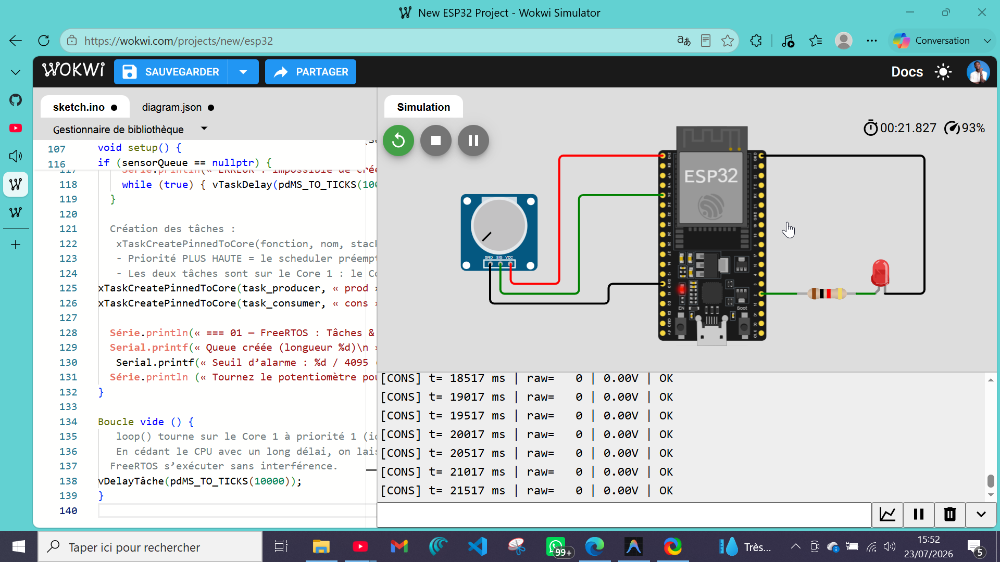
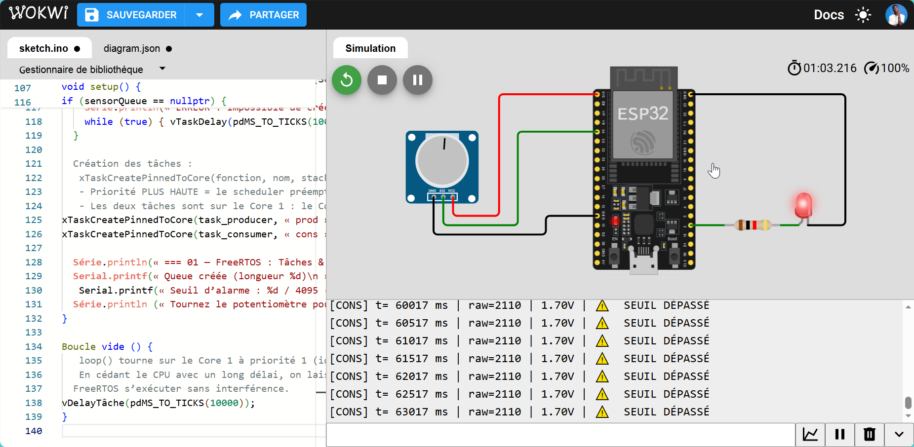

# 01 — FreeRTOS : Tâches & Queue

Deux tâches FreeRTOS communiquent via une **queue de messages** : un *producer* lit un capteur, un *consumer* traite les données et pilote une LED d'alarme.

---

## 🎯 Quel est l'objectif ?

- Créer deux tâches FreeRTOS (`xTaskCreatePinnedToCore`) sur l'ESP32
- Comprendre le rôle de la **priorité** et de l'**affectation au cœur** (Core 0 vs Core 1)
- Passer des données entre tâches via une **queue** (`xQueueCreate`, `xQueueSend`, `xQueueReceive`)
- Distinguer l'attente **bloquante** (`portMAX_DELAY`) de l'attente **non-bloquante** (timeout 0)

## 💡 Pourquoi cette technologie est-elle importante ?

Sans FreeRTOS, un firmware Arduino exécute une seule tâche séquentielle dans `loop()`. Dès qu'on veut faire plusieurs choses en parallèle — lire des capteurs *et* communiquer en MQTT *et* piloter des actionneurs *et* afficher sur un écran — on se retrouve soit avec un code spaghetti de `millis()`, soit avec des `delay()` qui bloquent tout le reste.

FreeRTOS résout ce problème en permettant d'organiser le firmware en **tâches indépendantes** que le scheduler préempte. La **queue** est le mécanisme de base pour que ces tâches s'échangent des données sans partager de variables globales (ce qui serait une source de bugs de concurrence).

C'est exactement l'architecture utilisée dans **SMART-SOJA** (`task_grafcet`, `task_sensors`, `task_lcd`, `task_mqtt`) — cette expérimentation en pose les fondations théoriques et pratiques.

## 🛠️ Quel matériel est utilisé ?

| Composant | Rôle |
|---|---|
| ESP32 DevKit | Microcontrôleur — double cœur Xtensa LX6 |
| Potentiomètre (10kΩ) | Source de signal variable pour le producer |
| LED (intégrée GPIO 2 ou externe) | Indicateur d'alarme piloté par le consumer |
| Résistance ~220Ω | Limite le courant (si LED externe) |

## ⚙️ Comment fonctionne le système ?

```
┌─────────────────────┐     Queue (5 slots)     ┌──────────────────────┐
│   task_producer     │ ──── SensorMessage ────► │   task_consumer      │
│   Core 1 | Prio 2   │                          │   Core 1 | Prio 1    │
│                     │                          │                      │
│  · analogRead(34)   │                          │  · Affichage série   │
│  · xQueueSend()     │                          │  · Alarme LED        │
│  · vTaskDelay(500ms)│                          │  · xQueueReceive()   │
└─────────────────────┘                          └──────────────────────┘
```

**Scheduler FreeRTOS** : quand `task_producer` appelle `vTaskDelay(500ms)`, elle se suspend et le scheduler donne la main à la tâche prête la plus prioritaire. De même, `task_consumer` en attente sur `xQueueReceive(portMAX_DELAY)` ne consomme aucun CPU — elle n'est réveillée que quand un message arrive dans la queue.

**Queue** : FreeRTOS **copie** la struct `SensorMessage` dans la queue (passage par valeur). Aucun pointeur partagé → aucun risque d'accès concurrent à la mémoire.

**Priorités** : `task_producer` (priorité 2) est plus prioritaire que `task_consumer` (priorité 1). Quand le producer se réveille, il préempte le consumer s'il était en cours d'exécution.

## 🔁 Comment reproduire l'expérience ?

**Câblage**

| ESP32 | Composant |
|---|---|
| GPIO 34 (ADC1_CH6, input-only) | Curseur du potentiomètre |
| 3V3 | Extrémité haute du potentiomètre |
| GND | Extrémité basse + cathode LED |
| GPIO 2 | LED intégrée (ou LED externe + R 220Ω) |

**Build & flash**

```bash
pio run -t upload
pio device monitor
```

**Comportement attendu**

```
=== 01 — FreeRTOS : Tasks & Queue ===
Queue créée (longueur 5)
Seuil d'alarme : 2048 / 4095 (1.6V)
Tournez le potentiomètre pour dépasser le seuil.

[CONS] t=  1003 ms | raw= 512 | 0.41V | OK
[CONS] t=  1503 ms | raw=1024 | 0.82V | OK
[CONS] t=  2003 ms | raw=2500 | 2.01V | ⚠️  SEUIL DÉPASSÉ
[CONS] t=  2503 ms | raw=3800 | 3.06V | ⚠️  SEUIL DÉPASSÉ
```

La LED s'allume dès que la valeur brute dépasse 2048. Tourner le potentiomètre en dessous du seuil l'éteint immédiatement.

## 📊 Quels résultats obtient-on ?

> 🔬 *Validation effectuée sous simulation Wokwi.*

<div align="center">

| Seuil OK (potentiomètre bas) | Seuil DÉPASSÉ (potentiomètre haut) |
|:---:|:---:|
|  |  |
| *Valeur brute ≤ 2048 — LED alarme éteinte* | *Valeur brute > 2048 — LED alarme allumée* |

</div>

| Mesure | Valeur typique observée |
|---|---|
| Fréquence de publication du producer | 1 message / 500 ms |
| Latence producer → consumer | < 1 ms (queue en RAM interne) |
| Occupation CPU du consumer en attente | 0% (tâche bloquée sur la queue) |
| Messages perdus (queue pleine) | 0 en fonctionnement normal |

**Comportement observé** : le découplage producteur/consommateur est immédiatement visible — le producer publie à rythme régulier indépendamment de la vitesse de traitement du consumer. Si le consumer était plus lent, les messages s'accumulent dans la queue (jusqu'à 5 slots) avant d'être abandonnés avec un avertissement série.

## 🧩 Quelles difficultés ont été rencontrées ?

- **Stack size** : chaque tâche reçoit sa propre pile (`4096 octets` ici). Un stack trop petit provoque un `StackOverflow` et un reboot. Surveiller avec `uxTaskGetStackHighWaterMark()` si des crashs apparaissent.
- **Core 0 réservé au Wi-Fi** : sur ESP32 classique, le stack Wi-Fi/BT tourne sur Core 0. Toujours épingler les tâches applicatives sur Core 1 (`xTaskCreatePinnedToCore(..., 1)`) pour éviter les contentions.
- **`xQueueSend` avec timeout 0 dans le producer** : si la queue est pleine, le message est abandonné sans bloquer. C'est le bon comportement pour un capteur à taux fixe — il vaut mieux perdre un échantillon que de bloquer le producer.
- **`ADC_11db` déprécié** : voir la note dans l'expérimentation `02-adc-analog-read`.

## 🔄 Quelles améliorations sont possibles ?

- Ajouter un **sémaphore de comptage** pour synchroniser une troisième tâche de logging
- Utiliser `xQueueSendToFront()` pour donner la priorité aux messages d'alarme
- Mesurer la latence exacte avec un deuxième timestamp dans `SensorMessage` (pris à la réception)
- Remplacer la LED par un buzzer PWM pour un retour sonore proportionnel à la valeur capteur
- **Prochaine étape** : `02-semaphores-and-mutexes` — protéger un accès concurrent à une ressource partagée (ex. LCD, bus I2C)
