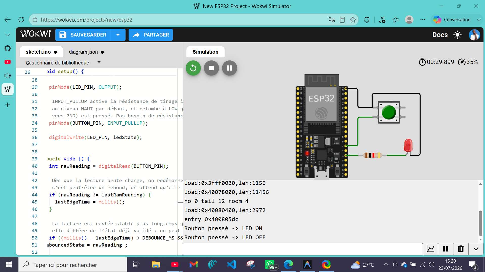
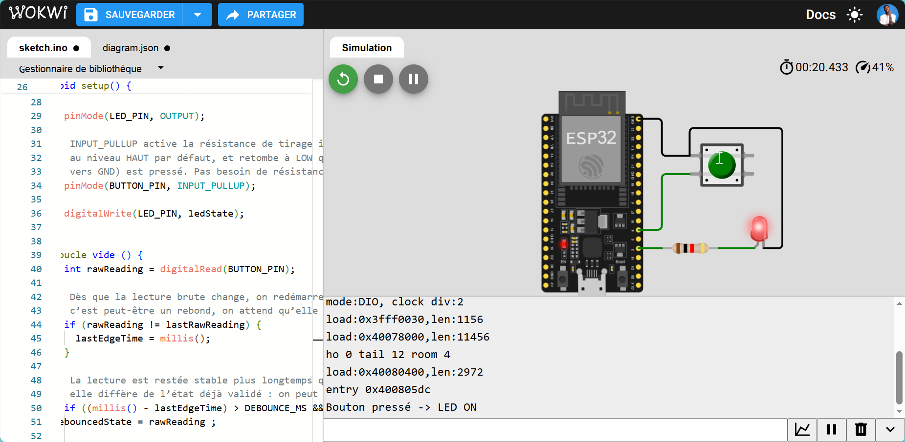

# 01 — GPIO: Digital I/O

Sortie digitale (LED) + entrée digitale (bouton-poussoir) sur ESP32, avec anti-rebond logiciel non-bloquant.

---

## 🎯 Quel est l'objectif ?

Configurer et manipuler des GPIO en tout-ou-rien :

- Configurer une broche en sortie (`OUTPUT`) et une broche en entrée avec résistance de tirage interne (`INPUT_PULLUP`)
- Lire un état logique de façon fiable malgré le rebond mécanique du bouton
- Écrire une boucle non-bloquante (`millis()`) plutôt que d'utiliser `delay()`

## 💡 Pourquoi cette technologie est-elle importante ?

Le GPIO tout-ou-rien est la brique de base de tout système embarqué : avant de lire un capteur analogique, de dialoguer en I2C ou de piloter un moteur, il faut maîtriser la lecture/écriture fiable d'un simple niveau logique. La gestion propre du rebond et l'écriture d'une boucle non-bloquante sont aussi les fondations de tous les futurs firmwares multi-tâches de ce lab (FreeRTOS, GRAFCET...) : on ne peut pas se permettre un `delay()` qui bloque le reste du système.

## 🛠️ Quel matériel est utilisé ?

| Composant | Rôle |
|---|---|
| ESP32 DevKit | Microcontrôleur |
| LED (intégrée à la carte ou externe) | Sortie digitale |
| Résistance ~220Ω | Limite le courant de la LED (si LED externe) |
| Bouton-poussoir | Entrée digitale |
| Câbles de liaison | Câblage |

## ⚙️ Comment fonctionne le système ?

- Une broche en sortie **impose** une tension (0V ou 3.3V) — c'est le microcontrôleur qui pilote la charge (ici la LED via résistance série).
- Une broche en entrée **lit** une tension. Sans résistance de tirage, un bouton non appuyé laisse la broche "flottante" (état indéterminé, bruité). `INPUT_PULLUP` active une résistance interne qui tire la broche au niveau haut par défaut : le bouton, câblé entre la broche et la masse, ramène la broche à `LOW` quand il est pressé.
- Le **rebond mécanique** (bounce) d'un bouton-poussoir génère plusieurs transitions HIGH/LOW parasites en quelques millisecondes lors d'un appui. L'anti-rebond logiciel ignore les transitions tant que l'état lu n'est pas resté stable pendant `DEBOUNCE_MS`.
- Chaque appui bref, une fois débruité, fait basculer l'état mémorisé de la LED (`ledState`) et met à jour la sortie.

## 🔁 Comment reproduire l'expérience ?

**Câblage**

| ESP32 | Composant |
|---|---|
| GPIO 2 | LED intégrée (la plupart des DevKits) ou LED externe + résistance ~220Ω vers GND |
| GPIO 4 | Bouton-poussoir → GND (l'autre broche du bouton) |
| GND | Commun |

Aucune résistance de pull-up externe nécessaire : elle est activée dans le code (`INPUT_PULLUP`).

**Build & flash**

```bash
pio run -t upload
pio device monitor
```

**Comportement attendu** : chaque appui bref sur le bouton fait basculer l'état de la LED (ON/OFF), sans rebond parasite. Le moniteur série affiche `Button pressed -> LED ON/OFF` à chaque bascule.

## 📊 Quels résultats obtient-on ?

> 🔬 *Validation effectuée sous simulation Wokwi.*

| État du bouton | Résultat |
|---|---|
| Relâché | LED éteinte (état initial) |
| Appui bref (> 30 ms) | LED bascule ON/OFF |
| Rebond mécanique | Ignoré — anti-rebond logiciel actif |

<div align="center">

| LED OFF | LED ON |
|:---:|:---:|
|  |  |
| *État initial / bouton relâché* | *Après un appui bref sur le bouton* |

</div>

| Mesure | Valeur typique observée |
|---|---|
| Temps d'anti-rebond efficace | 20–30 ms (DEBOUNCE_MS = 30 suffit) |
| Faux appuis sans anti-rebond | jusqu'à 5–10 transitions parasites par appui mécanique |
| Latence de réponse perçue | imperceptible (< 50 ms de bout en bout) |
| Courant consommé par la LED | ~7–10 mA avec résistance 220Ω sur 3.3V |

**Comportement observé** : chaque appui bref fait basculer la LED une seule fois de façon fiable. Sans anti-rebond, on observerait des basculements multiples non souhaités sur le même appui.

## 🧩 Quelles difficultés ont été rencontrées ?

- **Broche 0 (`BOOT`)** : éviter d'y câbler le bouton — elle est active au démarrage et peut bloquer le flash. GPIO 4 ou GPIO 5 sont des choix sûrs.
- **LED intégrée GPIO 2** : certains DevKit ont une LED active-low (câblée entre GPIO 2 et 3.3V), d'autres active-high (câblée vers GND). Si la LED semble inversée, ajuster la logique ou tester avec une LED externe.
- **Pull-up déjà présent sur certaines cartes** : si un pull-up externe de 10kΩ est déjà câblé sur la carte, `INPUT_PULLUP` reste compatible (deux résistances en parallèle ne posent pas de problème).

## 🔄 Quelles améliorations sont possibles ?

- Remplacer le polling par une interruption (`attachInterrupt`) — sujet de la prochaine expérimentation sur les interruptions
- Détecter un appui long vs appui court
