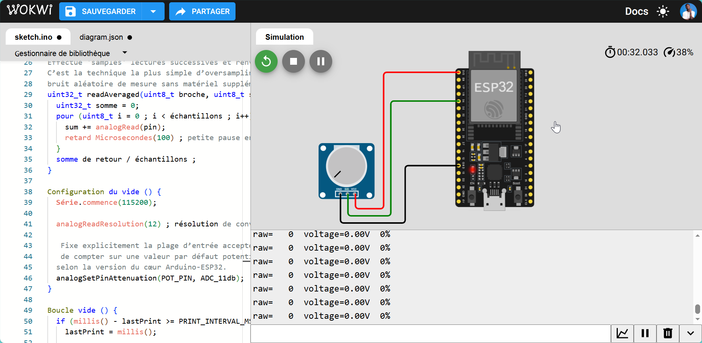

# 02 — ADC: Analog Read

Lecture d'une tension analogique (potentiomètre) sur ESP32, avec sur-échantillonnage pour réduire le bruit.

---

## 🎯 Quel est l'objectif ?

- Configurer et lire une entrée analogique (ADC) sur ESP32
- Convertir une valeur brute (0–4095) en tension réelle (0–3.3V)
- Réduire le bruit de mesure par moyennage (oversampling)

## 💡 Pourquoi cette technologie est-elle importante ?

La grande majorité des capteurs physiques (potentiomètre, capteur de température analogique, capteur d'humidité capacitif comme celui de SMART-SOJA, jauge de contrainte...) délivrent une tension continue proportionnelle à la grandeur mesurée. Savoir échantillonner cette tension correctement — et savoir que le convertisseur n'est pas un instrument parfait — est indispensable avant de faire de l'acquisition de données fiable.

## 🛠️ Quel matériel est utilisé ?

| Composant | Rôle |
|---|---|
| ESP32 DevKit | Microcontrôleur |
| Potentiomètre (10kΩ typique) | Source de tension variable à mesurer |
| Câbles de liaison | Câblage |

## ⚙️ Comment fonctionne le système ?

- L'ADC de l'ESP32 convertit une tension analogique en une valeur numérique sur `analogReadResolution(12)` bits, soit une plage brute de 0 à 4095.
- L'atténuation (`analogSetPinAttenuation(..., ADC_11db)`) définit la plage de tension d'entrée acceptée en pleine échelle ; à 11dB, l'ESP32 accepte environ 0–3.3V.
- **Limite connue** : l'ADC de l'ESP32 est réputé bruité et non-linéaire, en particulier près de 0V et de la pleine échelle. Le code atténue ce bruit en moyennant `OVERSAMPLES` (16) lectures consécutives avant de calculer la valeur affichée — une technique simple d'oversampling.
- La valeur brute moyennée est ensuite convertie en volts (`raw / 4095 * 3.3`) et en pourcentage.

## 🔁 Comment reproduire l'expérience ?

**Câblage**

| ESP32 | Composant |
|---|---|
| GPIO 34 (ADC1_CH6, input-only) | Curseur (broche centrale) du potentiomètre |
| 3V3 | Une extrémité du potentiomètre |
| GND | Autre extrémité du potentiomètre |

GPIO 34 est utilisée car c'est une broche ADC1 *input-only* : elle ne partage pas le convertisseur avec le Wi-Fi (contrairement à certaines broches ADC2), ce qui évite des lectures perturbées une fois le Wi-Fi actif dans de futures expérimentations.

**Build & flash**

```bash
pio run -t upload
pio device monitor
```

**Comportement attendu** : en tournant le potentiomètre, le moniteur série affiche en continu la valeur brute, la tension calculée et le pourcentage, mis à jour toutes les 200ms.

## 📊 Quels résultats obtient-on ?

> 🔬 *Validation effectuée sous simulation Wokwi.*

<div align="center">

| Potentiomètre bas | Potentiomètre haut |
|:---:|:---:|
|  |  |
| *Curseur à la position basse — raw ≈ 0–1000* | *Curseur à la position haute — raw ≈ 3000–4095* |

</div>

| Mesure | Valeur typique observée |
|---|---|
| Plage brute aux extrêmes | ~50–150 (au lieu de 0) et ~3950–4050 (au lieu de 4095) |
| Bruit de lecture brut (sans oversampling) | ±10 à ±30 LSB sur une tension stable |
| Bruit après moyennage 16× | ±2 à ±5 LSB — signal notablement plus stable |
| Non-linéarité à 0V / 3.3V | Visible : les 5–10% aux extrêmes de la plage sont compressés |
| Fréquence de mise à jour affichée | ~5 Hz (une ligne toutes les 200 ms) |

**Comportement observé** : la valeur brute fluctue visiblement sans oversampling. Avec 16 échantillons moyennés, le signal est nettement plus stable et exploitable pour un capteur analogique. La non-linéarité aux bords de plage (0V et 3.3V) confirme que l'ADC de l'ESP32 nécessite un étalonnage ou une plage d'utilisation réduite pour des mesures précises.

## 🧩 Quelles difficultés ont été rencontrées ?

- **Broche GPIO 34 input-only** : impossible de la configurer en sortie ou d'activer `INPUT_PULLUP` — elle n'a pas de résistance interne. C'est normal et documenté dans le datasheet ESP32.
- **`ADC_11db` déprécié** : dans les versions récentes du cœur Arduino-ESP32 (≥ 3.x), l'atténuation s'appelle `ADC_ATTEN_DB_12`. Si le code ne compile pas, remplacer `ADC_11db` par `ADC_ATTEN_DB_12`.
- **Partage ADC2 / Wi-Fi** : sur ESP32 classique (non S3), les broches ADC2 (GPIO 0, 2, 4, 12–15, 25–27) deviennent inutilisables dès que le Wi-Fi est actif. Toujours utiliser ADC1 (GPIO 32–39) pour les mesures analogiques dans un firmware Wi-Fi.

## 🔄 Quelles améliorations sont possibles ?

- Comparer la stabilité des lectures avec et sans oversampling (désactiver temporairement pour observer le bruit brut)
- Ajouter un filtre passe-bas logiciel (moyenne glissante exponentielle) pour un signal encore plus stable
- Étalonner la tension mesurée par rapport à un multimètre pour quantifier l'erreur réelle de l'ADC
