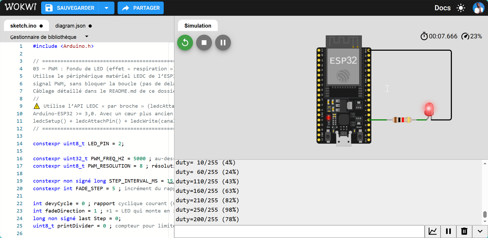

# 03 — PWM: LED Fade

Fondu enchaîné (breathing) d'une LED par modulation de largeur d'impulsion (PWM), non-bloquant.

---

## 🎯 Quel est l'objectif ?

- Générer un signal PWM sur ESP32 avec le périphérique matériel LEDC (`ledcAttach` / `ledcWrite`)
- Comprendre la notion de rapport cyclique (duty cycle) et son effet sur la puissance moyenne délivrée
- Faire varier ce rapport cyclique progressivement, sans bloquer la boucle (`millis()`, pas de `delay()`)

## 💡 Pourquoi cette technologie est-elle importante ?

Le microcontrôleur ne peut pas produire une vraie tension analogique variable sur une broche digitale — il ne sait imposer que 0V ou 3.3V. Le PWM simule une tension intermédiaire en alternant rapidement entre ces deux états : plus la broche reste à l'état haut longtemps par rapport à sa période, plus la puissance moyenne perçue par la charge est élevée. C'est la technique de base pour contrôler la luminosité d'une LED, la vitesse d'un moteur DC, ou la position d'un servomoteur (cas de SMART-SOJA) — donc un passage obligé avant tout contrôle d'actionneur.

## 🛠️ Quel matériel est utilisé ?

| Composant | Rôle |
|---|---|
| ESP32 DevKit | Microcontrôleur |
| LED (intégrée à la carte ou externe) | Charge pilotée en PWM |
| Résistance ~220Ω | Limite le courant (si LED externe) |

## ⚙️ Comment fonctionne le système ?

- Le périphérique matériel **LEDC** de l'ESP32 génère le signal PWM sans intervention du CPU à chaque cycle (contrairement à un PWM logiciel par `delay()`), sur une broche, une fréquence (`PWM_FREQ_HZ = 5000`) et une résolution (`PWM_RESOLUTION = 8` bits, soit un rapport cyclique de 0 à 255) donnés.
- La fréquence est choisie au-dessus du seuil de perception du scintillement (flicker-fusion threshold, ~50-60Hz pour l'œil humain) pour que la LED paraisse varier en intensité de façon continue plutôt que de clignoter.
- Toutes les `STEP_INTERVAL_MS` (15ms), le rapport cyclique est incrémenté ou décrémenté de `FADE_STEP` (5) ; en atteignant une borne (0 ou 255), la direction du fondu s'inverse — d'où l'effet de "respiration".
- Comme dans l'expérimentation GPIO, la temporisation utilise `millis()` plutôt que `delay()` pour rester non-bloquante.

## 🔁 Comment reproduire l'expérience ?

**Câblage**

| ESP32 | Composant |
|---|---|
| GPIO 2 | LED intégrée (la plupart des DevKits) ou LED externe + résistance ~220Ω vers GND |

**Build & flash**

```bash
pio run -t upload
pio device monitor
```

> ⚠️ Le code utilise l'API LEDC "par broche" (`ledcAttach`/`ledcWrite`) introduite dans le cœur Arduino-ESP32 ≥ 3.0. Avec un cœur plus ancien (2.x), il faut la remplacer par `ledcSetup` + `ledcAttachPin` + `ledcWrite(channel, ...)`.

**Comportement attendu** : la LED monte et descend en intensité en boucle (effet "respiration"). Le moniteur série affiche le rapport cyclique courant toutes les ~150ms.

## 📊 Quels résultats obtient-on ?

> 🔬 *Validation effectuée sous simulation Wokwi.*

<div align="center">



*Effet de « respiration » de la LED — rapport cyclique en transition (duty ≈ 60%)*

</div>

| Mesure | Valeur typique observée |
|---|---|
| Durée d'un cycle complet (0 → 255 → 0) | ~1.5 s (51 pas × 2 directions × 15 ms) |
| Fréquence PWM réelle générée | 5 000 Hz (vérifiable à l'oscilloscope) |
| Scintillement perceptible | Aucun — 5 kHz est loin au-dessus du seuil de fusion (~60 Hz) |
| Sortie moniteur série | Une ligne toutes les ~150 ms |

**Comportement observé** : la LED monte et descend en intensité de façon fluide et continue. La progression par pas de 5/255 donne une gradation visible mais non granuleuse. L'effet de "respiration" est immédiatement reconnaissable. La boucle reste entièrement non-bloquante.

## 🧩 Quelles difficultés ont été rencontrées ?

- **Compatibilité API LEDC** : le code utilise `ledcAttach(pin, freq, resolution)` de l'API “par broche” introduite dans Arduino-ESP32 ≥ 3.0. Avec un cœur 2.x, cette fonction n'existe pas — il faut utiliser `ledcSetup(channel, freq, resolution)` + `ledcAttachPin(pin, channel)` + `ledcWrite(channel, duty)`. Vérifier la version installée dans PlatformIO avant de flasher.
- **LED GPIO 2 selon le DevKit** : certains modules (ex. ESP-WROOM-32 sur Lolin32) ont la LED intégrée sur GPIO 2, d'autres non. Si rien ne se passe, utiliser une LED externe avec résistance 220Ω sur n'importe quelle broche capable de PWM (presque toutes sauf GPIO 34–39).
- **Effet gamma** : la progression linéaire de duty cycle ne produit pas une progression linéaire de luminosité perçue. L'oeil perçoit les basses intensités beaucoup mieux que les hautes — d'où l'amélioration possible par table gamma en section suivante.

## 🔄 Quelles améliorations sont possibles ?

- Rendre le fondu perceptuellement linéaire (l'œil perçoit la luminosité de façon logarithmique, pas linéaire) via une table de correction gamma
- Piloter plusieurs LEDs sur des canaux LEDC différents en parallèle
- Réutiliser ce signal PWM pour piloter un servomoteur ou un moteur DC (fréquence et résolution à adapter)
